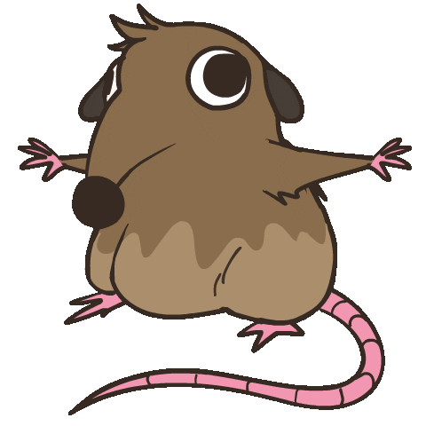
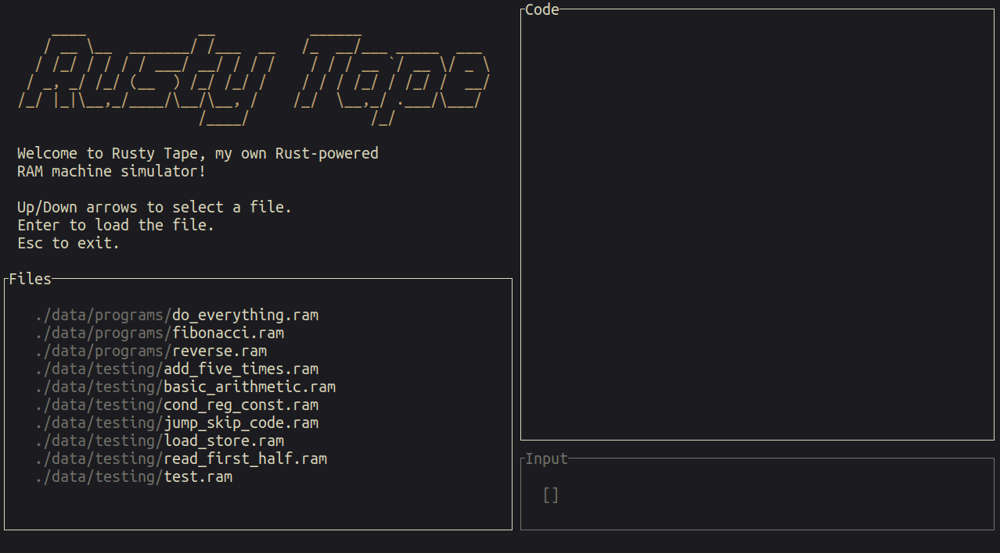

<!-- column_layout: [1, 1] -->

<!-- column: 0 -->

<!-- new_lines: 1 -->


<!-- column: 1 -->

## _Orhun Parmaksız_

✨ Open source, Rust and terminals!

🦀 **Ratatui**, **git-cliff**, binsider, kmon, systeroid…

📦 **Arch Linux** (btw)

`https://orhun.dev             `

`https://github.com/orhun      `

`https://youtube.com/@orhundev `

<!-- end_slide -->

<!-- column_layout: [1, 1] -->

<!-- column: 0 -->

<!-- jump_to_middle -->

Chapter 1: **Web to Terminal** 💻

<!-- column: 1 -->

<!-- new_lines: 6 -->


<!-- end_slide -->

<!-- column_layout: [3, 6] -->

<!-- column: 0 -->

# Ratatui


A Rust library that's all about cooking up terminal user interfaces (TUIs) 👨‍🍳🐀

`https://github.com/ratatui`

<!-- column: 1 -->

```rust {1-20|5|6|7,16-18|8-11|12-14|1-20}
use ratatui::crossterm::event::{self, Event};
use ratatui::{text::Text, Frame};

fn main() -> std::io::Result<()> {
    let mut terminal = ratatui::init();
    loop {
        terminal.draw(draw)?;
        if matches!(event::read()?, Event::Key(_)) {
            break;
        }
    }
    ratatui::restore();
    Ok(())
}

fn draw(frame: &mut Frame) {
    let text = Text::raw("Hello World!");
    frame.render_widget(text, frame.area());
}
```

<!-- end_slide -->

<!-- column_layout: [1, 1] -->

<!-- column: 0 -->

## Widgets

- Block
- BarChart
- Calendar
- Canvas
- Chart
- Gauge
- LineGauge
- List
- Paragraph
- Scrollbar
- Sparkline
- Table
- Tabs



<!-- column: 1 -->

## Concepts

- Rendering
  - **Buffer** ✨
- Layout
- Application patterns
- Backends
- Event handling

`https://ratatui.rs/concepts`

# Demo

```bash +exec +acquire_terminal
cargo run --manifest-path ratatui/examples/apps/demo2/Cargo.toml
```

<!-- end_slide -->

# "The TUI Look"

<!-- pause -->

<!-- column_layout: [2, 1] -->

<!-- column: 0 -->

```bash +exec +acquire_terminal
tv
```

`https://github.com/alexpasmantier/television`

<!-- pause -->

```bash +exec +acquire_terminal
tracker
```

`https://github.com/ShenMian/tracker`

<!-- end_slide -->



<!-- column_layout: [1, 2] -->

<!-- column: 1 -->

🖥️ Pane-based layout  
🗂️ Pop-up menus  
🎨 Highlight colors

<!-- end_slide -->

<!-- column_layout: [2, 1] -->

<!-- column: 0 -->

**Minitel**: Rust stack for the French videotex terminal system from the 1980s.

`https://github.com/plule/minitel`

```bash +exec
mpv --quiet --loop-file assets/minitel-ratatui.mp4
```

<!-- end_slide -->

```rust
Text::raw("Hello World!");
```

<!-- pause -->

```rust
Paragraph::new("Hello World!").wrap(Wrap { trim: true });
```

<!-- pause -->

```rust
let text = Paragraph::new("Hello World!")
    .wrap(Wrap { trim: true })
    .centered()
    .block(
        Block::bordered()
            .border_type(BorderType::Rounded)
            .title_top(Line::from("Title").centered())
            .title_bottom(Line::from("!").right_aligned()),
    );
```

<!-- end_slide -->

```rust
let block = Block::bordered()
    .style(Style::default().bg(Color::Black).fg(Color::White))
    .border_type(BorderType::Rounded)
    .title(Line::from(" ✨ Title ✨ ".black().on_blue().bold()).centered())
    .title_bottom(Line::from(" ⚡ Bottom ⚡ ".black().on_green().italic()).right_aligned());

let text = Paragraph::new("Hello, World!".red())
    .wrap(Wrap { trim: true })
    .centered()
    .block(block);
```

```bash +exec +acquire_terminal
cargo run --manifest-path code/Cargo.toml --bin styling
```

<!-- end_slide -->

```bash +exec +acquire_terminal
exabind
```

<!-- pause -->

# TachyonFX

Shader-like effects library for Ratatui applications

`https://github.com/junkdog/tachyonfx`

<!-- pause -->

```bash +exec +acquire_terminal
cargo run --manifest-path tachyonfx/Cargo.toml --example fx-chart
```

<!-- end_slide -->

# Tek

A music making program for 24-bit unicode terminals.

`https://codeberg.org/unspeaker/tek`

```bash +exec +acquire_terminal
tek_sequencer
```

<!-- end_slide -->

<!-- column_layout: [1, 1] -->

<!-- column: 0 -->

<!-- jump_to_middle -->

Chapter 2: **Terminal to Web** 💻

<!-- column: 1 -->

<!-- new_lines: 5 -->


<!-- end_slide -->
