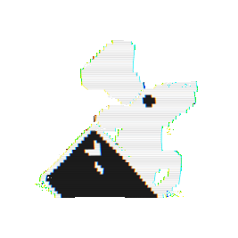
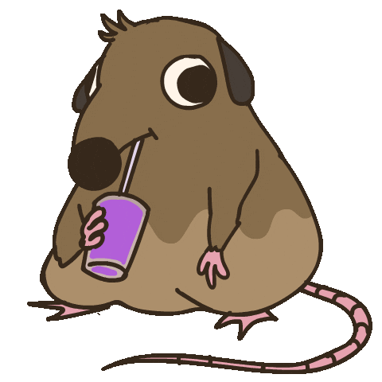
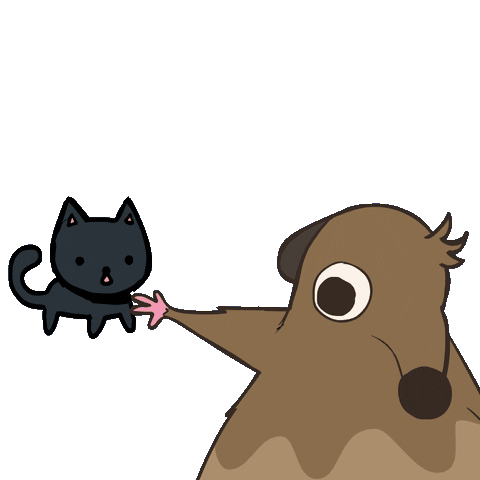

<!-- column_layout: [1, 1] -->

<!-- column: 0 -->

<!-- new_lines: 1 -->


<!-- column: 1 -->

<!-- pause -->

## _Orhun Parmaksız_

✨ Open source, Rust and terminals!

🦀 **Ratatui**, **git-cliff**, binsider, kmon, systeroid…

📦 **Arch Linux** (btw)

`https://orhun.dev             `

`https://github.com/orhun      `

`https://youtube.com/@orhundev `

<!-- end_slide -->

<!-- column_layout: [1, 1] -->

<!-- column: 0 -->

<!-- jump_to_middle -->

Chapter 1: **Web to Terminal** 💻

<!-- column: 1 -->

<!-- new_lines: 6 -->


<!-- end_slide -->

# Ratatui

<!-- column_layout: [3, 6] -->

<!-- column: 0 -->

<!-- new_lines: 1 -->



<!-- pause -->

<!-- column: 1 -->

<!-- new_lines: 2 -->

A Rust library that's all about cooking up terminal user interfaces (TUIs) 👨‍🍳🐀

`https://github.com/ratatui`

```bash +exec +acquire_terminal
cargo run --manifest-path ratatui/examples/apps/demo2/Cargo.toml
```

<!-- end_slide -->

<!-- column_layout: [1, 1] -->

<!-- column: 0 -->

## Widgets

- Block
- BarChart
- Calendar
- Canvas
- Chart
- Gauge
- LineGauge
- List
- Paragraph
- Scrollbar
- Sparkline
- Table
- Tabs

<!-- column: 1 -->

<!-- pause -->

## Concepts

- Rendering
  - **Buffer** ✨
- Layout
- Application patterns
- **Backends** ✨
- Event handling

`https://ratatui.rs/concepts`


<!-- end_slide -->

```rust {1-20|5|6|7,16-18|8-11|12-14|1-20}
use ratatui::crossterm::event::{self, Event};
use ratatui::{text::Text, Frame};

fn main() -> std::io::Result<()> {
    let mut terminal = ratatui::init();
    loop {
        terminal.draw(draw)?;
        if matches!(event::read()?, Event::Key(_)) {
            break;
        }
    }
    ratatui::restore();
    Ok(())
}

fn draw(frame: &mut Frame) {
    let text = Text::raw("Hello World!");
    frame.render_widget(text, frame.area());
}
```

<!-- end_slide -->

# "The TUI Look"

<!-- pause -->

<!-- column_layout: [3, 2] -->

<!-- column: 0 -->

```bash +exec +acquire_terminal
tv
```

`https://github.com/alexpasmantier/television`

<!-- column: 1 -->

General purpose fuzzy finder

<!-- pause -->

<!-- reset_layout -->

<!-- column_layout: [3, 2] -->

<!-- column: 0 -->

```bash +exec +acquire_terminal
tracker
```

`https://github.com/ShenMian/tracker`

<!-- column: 1 -->

Real-time satellite tracking and orbit prediction

<!-- end_slide -->


<!-- column_layout: [1, 2] -->

<!-- column: 1 -->

🖥️ Pane-based layout  
🗂️ Pop-up menus  
🎨 Highlight colors

<!-- end_slide -->

<!-- column_layout: [2, 1] -->

<!-- column: 0 -->

## Minitel

Rust stack for the French videotex terminal system from the 1980s.

`https://github.com/plule/minitel`

```bash +exec
mpv --quiet --loop-file assets/minitel-ratatui.mp4
```

<!-- end_slide -->

```rust
Text::raw("Hello World!");
```

<!-- pause -->

```rust
Paragraph::new("Hello World!").wrap(Wrap { trim: true });
```

<!-- pause -->

```rust
let text = Paragraph::new("Hello World!")
    .wrap(Wrap { trim: true })
    .centered()
    .block(
        Block::bordered()
            .border_type(BorderType::Rounded)
            .title_top(Line::from("Title").centered())
            .title_bottom(Line::from("!").right_aligned()),
    );
```

<!-- end_slide -->

```rust
let block = Block::bordered()
    .style(Style::default().bg(Color::Black).fg(Color::White))
    .border_type(BorderType::Rounded)
    .title(Line::from(" ✨ Title ✨ ".black().on_blue().bold()).centered())
    .title_bottom(Line::from(" ⚡ Bottom ⚡ ".black().on_green().italic()).right_aligned());

let text = Paragraph::new("Hello, World!".red())
    .wrap(Wrap { trim: true })
    .centered()
    .block(block);
```

<!-- pause -->

```bash +exec +acquire_terminal
cargo run --manifest-path code/Cargo.toml --bin styling
```

<!-- end_slide -->

```bash +exec +acquire_terminal
exabind
```

<!-- pause -->

# TachyonFX

Shader-like effects library for Ratatui applications

`https://github.com/junkdog/tachyonfx`

`https://github.com/junkdog/exabind`

```bash +exec +acquire_terminal
cargo run --manifest-path tachyonfx/Cargo.toml --example fx-chart
```

<!-- end_slide -->

<!-- column_layout: [1, 1] -->

<!-- column: 0 -->

```rust
pub struct Buffer {
    pub area: Rect,
    pub content: Vec<Cell>,
}
```

<!-- column: 1 -->


<!-- pause -->

<!-- reset_layout -->

<!-- column_layout: [1, 1] -->

<!-- column: 1 -->

```rust
pub struct Rect {
    pub x: u16,
    pub y: u16,
    pub width: u16,
    pub height: u16,
}
```

<!-- column: 0 -->

<!-- pause -->

```rust
pub struct Cell {
    pub fg: Color,
    pub bg: Color,
    pub underline_color: Color,
    pub modifier: Modifier,
    pub skip: bool,
}
```

<!-- end_slide -->

```
    0   1   2   3   4   5   6   7   8   9  10  11
  ┌───┬───┬───┬───┬───┬───┬───┬───┬───┬───┬───┬───┐
0 │ H │ e │ l │ l │ o │   │ W │ o │ r │ l │ d │ ! │
  ├───┼───┼───┼───┼───┼───┼───┼───┼───┼───┼───┼───┤
1 │   │   │   │   │ ▲ │   │   │   │   │   │   │   │
  ├───┼───┼───┼───┼─│─┼───┼───┼───┼───┼───┼───┼───┤
2 │   │   │   │   │ │ │   │   │   │   │   │   │   │
  ├───┼───┼───┼───┼─│─┼───┼───┼───┼───┼───┼───┼───┤
3 │   │   │ ┌─────┴─────┐ │   │   │   │   │   │   │
  └───┴───┴─│ ┴───┴───┴ │ ┴───┴───┴───┴───┴───┴───┘
            │           │
      ┌─────┴─────┐  ┌──┴──┐
      │  symbol   │  │style│
      │   “o”     │  │Reset│
      └───────────┘  └─────┘
```

<!-- reset_layout -->

<!-- column_layout: [1, 7] -->

<!-- column: 1 -->

`https://ratatui.rs/concepts/rendering/under-the-hood/`

<!-- end_slide -->

### Tek

A music making program for 24-bit unicode terminals.

`https://codeberg.org/unspeaker/tek`

```bash +exec +acquire_terminal
tek_sequencer
```


<!-- end_slide -->

## Conclusion

<!-- pause -->

✨ A E T H E S T I C S

✅ Modern look and feel for terminal applications

🤔 Question: Is this the future?


<!-- end_slide -->

<!-- column_layout: [1, 1] -->

<!-- column: 0 -->

<!-- jump_to_middle -->

Chapter 2: **Terminal to Web** 🌐

<!-- column: 1 -->

<!-- new_lines: 5 -->


<!-- end_slide -->

# Xterm.js

```html {1-14|11}
<html>
  <head>
    <link rel="stylesheet" href="node_modules/@xterm/xterm/css/xterm.css" />
    <script src="node_modules/@xterm/xterm/lib/xterm.js"></script>
  </head>
  <body>
    <div id="terminal"></div>
    <script>
      var term = new Terminal();
      term.open(document.getElementById("terminal"));
      term.write("Hello from \x1B[1;3;31mxterm.js\x1B[0m");
    </script>
  </body>
</html>
```

<!-- end_slide -->

## Ratatui's Backend

```rust {1-16|2-3}
pub trait Backend {
    fn draw<'a, I>(&mut self, content: I) -> Result<()>
       where I: Iterator<Item = (u16, u16, &'a Cell)>;
    fn hide_cursor(&mut self) -> Result<()>;
    fn show_cursor(&mut self) -> Result<()>;
    fn get_cursor_position(&mut self) -> Result<Position>;
    fn set_cursor_position<P: Into<Position>>(
        &mut self,
        position: P,
    ) -> Result<()>;
    fn clear(&mut self) -> Result<()>;
    fn size(&self) -> Result<Size>;
    fn window_size(&mut self) -> Result<WindowSize>;
    fn flush(&mut self) -> Result<()>;
    // ...
}
```

<!-- end_slide -->

```rust {1-9|4,6-8}
impl Backend for TestBackend {
    fn draw<'a, I>(&mut self, content: I) -> io::Result<()>
    where
        I: Iterator<Item = (u16, u16, &'a Cell)>,
    {
        for (x, y, c) in content {
            self.buffer[(x, y)] = c.clone();
        }
        Ok(())
    }
}
```


<!-- end_slide -->

# egui_ratatui

A ratatui backend that is also an egui widget.

`https://github.com/gold-silver-copper/egui_ratatui`

Demo: https://gold-silver-copper.github.io/

<!-- pause -->

```bash +exec
cargo run --manifest-path egui_ratatui/bevy_example/Cargo.toml
```

<!-- end_slide -->

```rust
App::new()
    .add_plugins(DefaultPlugins)
    .init_resource::<BevyTerminal<RataguiBackend>>()
```

<!-- pause -->

```rust
impl Backend for RataguiBackend { ... }
```

<!-- pause -->

```rust
impl egui::Widget for &mut RataguiBackend { ... }
```


<!-- end_slide -->

# webatui

An integration between the Yew framework and Ratatui  
for making TUI-themed WASM webapps

`https://github.com/TylerBloom/webatui`

Demo: https://avid-rustacean.shuttleapp.rs/

<!-- pause -->

```bash +exec
pkill trunk
cd webatui/examples/counter
trunk serve
```

<!-- end_slide -->

1. Create a struct that will hold your app's logic
2. Implement the `TerminalApp` trait for it
3. Run the `run_tui` function with an instance of your app.

<!-- pause -->

```rust
struct MyApp { title: String }

impl TerminalApp for MyApp {
    type Message = ();
    fn update(
      &mut self, _: TermContext<'_, Self>,
      _: Self::Message) -> bool { false }

    fn render(&self, area: Rect, frame: &mut Frame<'_>) {
        let para = Paragraph::new(self.title.as_str());
        frame.render_widget(para, area);
    }
}

run_tui(MyApp { title: "Hello WWW!".into() })
```

<!-- end_slide -->




<!-- end_slide -->

```rust
let button_style = Style::new()
    .fg(Base16Accent::Accent01.to_color())
    .to_hydrate();
```

<!-- pause -->

```rust
impl TerminalApp for Counter {
  fn hydrate(&self, ctx: &Context<WebTerminal<Self>>, span: &mut DehydratedSpan) {
      match span.text() {
          "+1" => span.on_click(ctx.link().callback(|_| CounterMsg::Inc)),
          "-1" => span.on_click(ctx.link().callback(|_| CounterMsg::Dec)),
          _ => {}
      }
  }
}
```

<!-- end_slide -->


<!-- column_layout: [1, 4] -->

<!-- column: 1 -->

<!-- pause -->

We want:

1. No Javascript, only Rust
2. Only depend on Ratatui
3. Easy to set up
4. Easy to convert existing apps

_"Write Rust once, run everywhere."_

<!-- end_slide -->

<!-- new_lines: 3 -->



<!-- end_slide -->

<!-- column_layout: [1, 1] -->

<!-- column: 0 -->


<!-- pause -->

<!-- column: 1 -->

## web-sys

> https://rustwasm.github.io

_"Like **libc**, but for the web"_

<!-- pause -->

## trunk

> https://trunkrs.dev

_"WASM application bundler for Rust"_

• Works with standard `main()` function

• Bundle WASM, JS snippets, images, css, scss etc.

• Uses a source HTML file

<!-- end_slide -->

### Rendering

<!-- pause -->

```rust
let f = Rc::new(RefCell::new(None));
let g = f.clone();
let mut i = 0;
*g.borrow_mut() = Some(Closure::new(move || {
    // Set the body's text content to how many times this
    // requestAnimationFrame callback has fired.
    i += 1;
    let text = format!("RAF has been called {i} times.");
    body().set_text_content(Some(&text));
    // Schedule for another requestAnimationFrame callback.
    request_animation_frame(f.borrow().as_ref().unwrap());
}));

request_animation_frame(g.borrow().as_ref().unwrap());
```

> https://rustwasm.github.io/wasm-bindgen/examples/request-animation-frame

<!-- end_slide -->

### Backend

<!-- pause -->

#### DOM

```html
<div id="grid">
  <pre style="margin: 0px;">
    <span style="color: rgb(100, 100, 100);">█</span>
    <span style="color: rgb(100, 100, 100);">█</span>
  </pre>
</div>
```

<!-- pause -->

#### Canvas

```rust
let element = window().document().create_element("canvas");
let canvas = element.dyn_into::<web_sys::HtmlCanvasElement>();
// <canvas width="1400" height="1000"></canvas>
```

<!-- end_slide -->

### Events

<!-- pause -->

```rust
let closure = Closure::<dyn FnMut(_)>::new(move |event: web_sys::KeyboardEvent| {
  // Handle the event
});

window().document()
  .add_event_listener_with_callback(
    "keydown", closure.as_ref().unchecked_ref()
  );
```


<!-- end_slide -->

```rust
fn main() -> std::io::Result<()> {
    let backend = DomBackend::new()?;
    let terminal = Terminal::new(backend)?;

    terminal.on_key_event(move |event| match event.code {
        KeyCode::Char(c) => {
            // Handle the key event
        }
        _ => {}
    });

    terminal.draw_web(move |frame| {
        // Draw the UI
    });

    Ok(())
}
```

<!-- column_layout: [2, 1] -->

<!-- column: 1 -->

🥁 _Introducing..._

<!-- end_slide -->

# Ratzilla

<!-- pause -->

Build terminal-themed web applications with Rust and WebAssembly.

`https://github.com/orhun/ratzilla`

<!-- pause -->

```bash +exec
pkill trunk
cd ratzilla/examples/demo
trunk serve
```

<!-- reset_layout -->


<!-- end_slide -->

_Also announcing..._

<!-- pause -->

### Terminal Collective 🖥️

https://terminalcollective.org

A community for open-source terminal software enthusiasts.

`https://github.com/terminalcollective`


<!-- end_slide -->

#### Extra: Going full circle

<!-- pause -->

- [cuervo](https://github.com/mcclure/cuervo)
- [brow.sh](https://www.brow.sh)
- [carbonyl](https://github.com/fathyb/carbonyl)
-

<!-- jump_to_middle -->


<!-- end_slide -->

_On a personal note:_

<!-- pause -->


<!-- pause -->

<!-- column_layout: [4, 3] -->

<!-- column: 1 -->

For motivation visit _https://grindhouse.dev_

<!-- end_slide -->

<!-- column_layout: [1, 5] -->

<!-- column: 1 -->

### Thank you!

<!-- reset_layout -->


<!-- column_layout: [1, 5] -->

<!-- column: 1 -->

- https://github.com/orhun
- https://github.com/orhun/ratzilla
- https://github.com/terminalcollective

✨ Slides: _https://github.com/orhun/fosdem2025_

<!-- reset_layout -->

<!-- column_layout: [2, 5] -->

<!-- column: 1 -->

_P.S. I don't have a rat under my hat_
